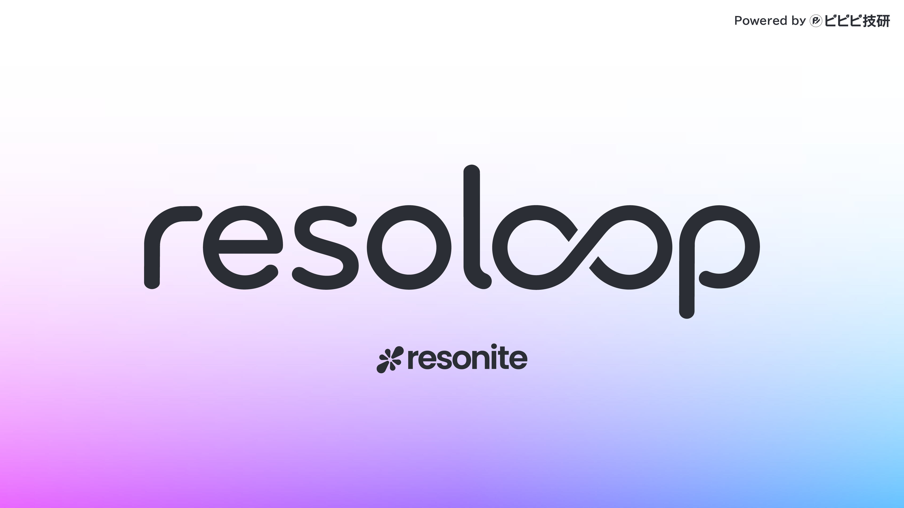

[English](README.md)｜[日本語](README_JA.md)

# resoloop

resoloop is a CLI for controlling Resonite worlds from AI agents such as Codex and Claude Code.

Tell the AI what you want to create, and it will inspect the current world, describe the Slot and Component structure in files, and apply and verify the result through ResoniteLink. Because the work is stored as files, you can apply the same structure repeatedly and track changes with Git.

resoloop automatically adds `FrooxEngine.AI_GeneratedContent` to the root of the content it generates and records the running tool's name and version in `Source` (for example, `[resoloop 0.1.0-preview.5]`). The same tag is also added to portable and equippable roots within the declaration tree.

> [!NOTE]
> resoloop is currently in preview. ResoniteLink is also in Beta, so updates may change its behavior.

## Installation

Requirements:

- Windows 10 or 11
- [`.NET 10 SDK`](https://dotnet.microsoft.com/download/dotnet/10.0)
- Resonite
- An AI coding agent such as Codex or Claude Code

Install resoloop in PowerShell:

~~~powershell
dotnet tool install --global ResoLoop --version 0.1.0-preview.5
resoloop --version
~~~

If resoloop is already installed, update it with the following command:

~~~powershell
dotnet tool update --global ResoLoop --version 0.1.0-preview.5
~~~

## Usage

### 1. Create a project

Create a dedicated project for each thing you want to build in Resonite.

~~~powershell
resoloop init MyResoniteProject
Set-Location MyResoniteProject
~~~

### 2. Configure ResoniteLink

1. Start Resonite and open the world you want to edit.
2. Open the `Settings` tab on the Dashboard's `Session` page.
3. Select `Enable ResoniteLink` in the lower-left corner.
4. When `ResoniteLink running on port: ...` appears, note the port number.
5. In the PowerShell session for your project, set the displayed port in an environment variable.

For example, if the displayed port is `12449`:

~~~powershell
$env:RESONITE_LINK_URL="ws://localhost:12449"
resoloop doctor
~~~

The setup is complete when `ready` appears at the end.

Alternatively, tell the AI which port to use when making your request:

~~~text
Create a box in Resonite that glows in rainbow colors. ResoniteLink is running on port 12449.
~~~

### 3. Ask the AI to work on your project

Open the project you created in an AI agent. If you have continued using the same AI session since creating the project, reopen the session once so that the agent can discover the generated Skill.

Then describe what you want to build in Resonite using ordinary language. For example:

~~~text
Create a teleporter gun in Resonite. Make it an equippable item shaped like a gun. When fired, it should launch a projectile in an arc and teleport me to the point where the projectile lands.
~~~

## Learn more

- [Detailed documentation](README-DETAILS.md) — commands, architecture, declaration format, Flux-SDK, and limitations
- [Quick start](docs/QUICKSTART.md) — detailed steps including applying, verifying, and using ProtoFlux
- [Declaration format](docs/DECLARATIVE.md) — specification for `content/*.json`
- [Roadmap](docs/ROADMAP.md)

## License

[AGPL-3.0-or-later](LICENSE)
