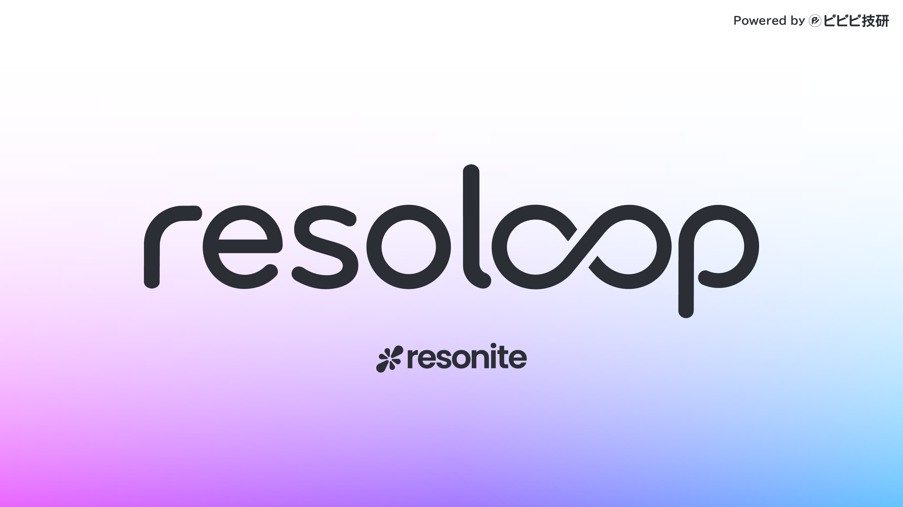

[English](README.md)｜[日本語](README_JA.md)

# resoloop

ワールド保存・再読込後は、state の `assetFields` に記録した `$asset:` 宣言が一致する場合、import 済みアセットの `resdb:///` URL を保持します。記録のない旧 state で対応関係を確認できない場合は、変更前に `APPLY_ASSET_MIGRATION_UNVERIFIED` で停止します。アセットの実体を確認し、manifest の asset source に検証済みの保存先 URI（例: `"source": "resdb:///…"`）を明示してから `diff` を再実行してください。変更済みの宣言だけで対応を推測したり、state を削除して検査を回避したりしないでください。フィールド書き込みが中断した場合は checkpoint を保持し、同じ manifest で再実行します。

## UIX制作の効率化

新規制作では `children` に `{"$recipe":"button","$with":{"key":"accept","rect":{}}}` と直接記述できます。include/export不要で、生成キーは `uix-button--accept` を接頭辞にします。既存prototypeのキーは変わりません。適用済み宣言の移行にはキー変更の確認が必要です。

適用後の値・参照確認は `resoloop observe '$member:state.Value' '$member:toggle.TargetValue' --state STATE --json` で最大64フィールドを一括取得できます。型・member ID・参照先IDを保持し、存在しない指定は失敗します。再接続時は既存のstable参照解決を使います。異なるComponentの値は順次取得であり、同一瞬間のsnapshotではありません。

`uix recipe list --json` で機能構造のレシピ、`uix recipe describe button --json` で引数と接続口を確認できます。button・boolean-state・scroll-contentに加え、text-input・toggle・choice・slider・value-stateを同梱しています。共通の選択状態からタブや開閉パネルも構成できます。色・形・文字・寸法・押下時の表現はレシピに固定せず、利用側で自由に構成します。

```powershell
resoloop uix recipe export button --output content/recipes/button.json --json
resoloop diff content/main.json --brief --report artifacts/plan-01.json --json
resoloop apply content/main.json --brief --json
```

エクスポートした通常のprototype JSONをincludeして使います。[レシピの接続方法](skills/codex/resonite-uix/references/recipes.md)を参照してください。`--brief`は差分・監査などの表示量を減らし、`--report`は省略前の詳細を新規ファイルに保存します。既存ファイルは上書きしません。diffには宣言・runtime型検証が含まれるため、通常作業でvalidateの2モードを重ねる必要はありません。apply自身の直前検証は維持します。



resoloop は、Codex や Claude Code などの AI エージェントから Resonite のワールドを操作するための CLI です。

作りたいものを AI に伝えると、AI が現在のワールドを確認し、Slot や Component の構成をファイルへ記述して、ResoniteLink 経由で反映・検証します。作業内容がファイルとして残るため、同じ構成を繰り返し適用したり、Git で変更を管理したりできます。

resoloop が生成する作業ルートには `FrooxEngine.AI_GeneratedContent` を自動で付与し、`Source` に実行中のツール名とバージョン（例: `[resoloop 0.1.0-preview.9]`）を記録します。宣言ツリー内の持ち運び・装備用ルートにも同じタグを付与します。

> [!NOTE]
> 現在はプレビュー版です。ResoniteLink も Beta のため、更新によって動作が変わる可能性があります。

## インストール

必要なもの:

- Windows 10 / 11
- [`.NET 10 SDK`](https://dotnet.microsoft.com/download/dotnet/10.0)
- Resonite
- Codex、Claude Code などの AI コーディングエージェント

PowerShell で resoloop をインストールします。

~~~powershell
dotnet tool install --global ResoLoop --version 0.1.0-preview.15
resoloop --version
~~~

すでにインストール済みの場合は、次のコマンドで更新できます。

~~~powershell
dotnet tool update --global ResoLoop --version 0.1.0-preview.15
~~~

## 使い方

### 1. プロジェクトを作る

Resonite で作りたいものごとに、専用のプロジェクトを作成します。

~~~powershell
resoloop init MyResoniteProject
Set-Location MyResoniteProject
~~~

### 2. ResoniteLink を設定する

1. Resonite を起動し、編集したいワールドを開きます。
2. Dashboard の `Session` ページから `Settings` タブを開きます。
3. 画面左下の `Enable ResoniteLink` を選択します。
4. `ResoniteLink running on port: ...` と表示されればOK。

あとはresoloopが自動でポートを見つけて接続します。

環境変数を使って自分で設定することもできますが必須ではありません。

たとえば、表示されたポートが `12449` の場合:

~~~powershell
$env:RESONITE_LINK_URL="ws://localhost:12449"
resoloop doctor
~~~

最後に `ready` と表示されれば準備完了です。

### 3. AI に作業を依頼する

作成したプロジェクトを AI エージェントで開きます。プロジェクト作成後から同じ AI セッションを使い続けている場合は、生成された Skill を認識させるため、一度セッションを開き直してください。

あとは、Resonite で実現したい内容を普段の言葉で依頼します。たとえば:

~~~text
Resoniteでテレポーターガンを作って。装備できるアイテムで、銃みたいな形。銃を撃つと弾が山なりに飛んでいって、当たった地点に自分がワープするようにして。
~~~

## Blenderによるモデル制作

複雑なモデルの制作を依頼したときは、resoloopがBlenderを使うことがあります。

PCにBlenderがインストールされていれば自動で検出して利用します。

Blenderを立ち上げておく必要はありません。

## さらに詳しく

宣言形式の推測を減らすため、`resoloop manifest scaffold --key panel --output content/panel.json --json` で外観を含まない宣言を作成できます。必要な項目だけ `resoloop schema describe camera --json` で照会してください。

Reflectionは `type query --request FILE.json --json` で必要なmemberとenum候補を一括取得できます。要求形式は `schema describe reflection --json` で確認できます。保存した型定義はResonite・ResoniteLinkのバージョンとAdapter/Coreビルドが一致すれば、期限なしでcheck・diff・apply・値変換にも利用します。ローカル接続のポート変更では失効しません。`verified: true` はバージョン一致で信頼した結果も含み、`source: version-cache` と元の観測時刻で区別できます。`--refresh` は実機から更新、`--cache off` はディスクを読み書きせず実機照会、`--cache-dir DIR` は保存先の指定です。MOD/DLL構成を変えた場合は更新してください。ID・現在値・参照先は毎回実環境から確認します。`type check --manifest FILE.json --brief --json` はstrict検証を利用しますが、diff/apply直前の重複チェックは不要です。[設計・実測結果](docs/REFLECTION-EFFICIENCY.md)を参照してください。

新規素材は `manifest scaffold --kind provider --key front-material --type '[FrooxEngine]FrooxEngine.UI_UnlitMaterial' --output NEW_NODE.json` で名前付きSlotを生成し、childrenへ追加して見た目の設定を記入します。validate/diffは同一Slot内の識別リスクを警告します。

適用済みの平面Canvasは `resoloop capture content/panel.json --frame '$slot:canvas' --view front --output artifacts/front.jpg --json` で自動撮影できます。背面は `--view rear`。対象を動かさず実測矩形から距離を計算します。曲面・はみ出す子要素・遮蔽物等は明示カメラで確認してください。[詳細と検証](docs/AUTHORING-ASSISTANCE.md)。

- [詳細資料](README-DETAILS.md) — コマンド、設計、宣言形式、Flux-SDK、制約
- [クイックスタート](docs/QUICKSTART.md) — 適用、検証、ProtoFlux を含む詳しい手順
- [宣言形式](docs/DECLARATIVE.md) — `content/*.json` の仕様
- [ロードマップ](docs/ROADMAP.md)

## ライセンス

[AGPL-3.0-or-later](LICENSE)
